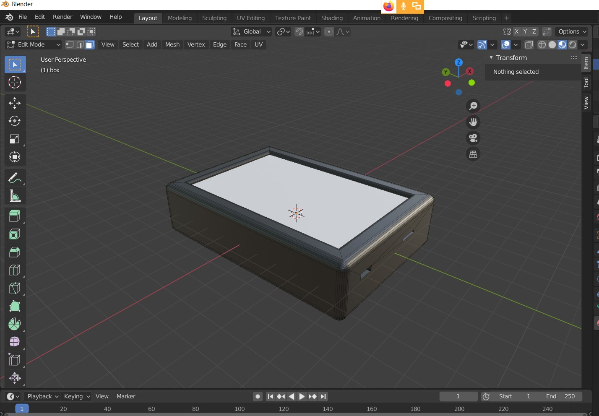

## 3. Project Evaluation
### Contents
  - [a. Reflective discussion of the success of the project](#a-reflective-discussion-of-the-success-of-the-project)
      - [IoT hardware](#iot-hardware)
      - [Communication protocols](#communication-protocols)
  - [b. Discussion of future work (in terms of design, development and evaluation)](#b-discussion-of-future-work-in-terms-of-design-development-and-evaluation)
    - [Market Research](#market-research)
    - [Improved User Customisation](#improved-user-customisation)
    - [Implementing Social Networking Features](#implementing-social-networking-features)
    - [Hardware improvements](#hardware-improvements)
    - [Future prototype](#future-prototype)
  - [c. Reflect on the working practices of your group, how well they did or did not work, e.g, management of issues, communication, Agile (etc).](#c-reflect-on-the-working-practices-of-your-group-how-well-they-did-or-did-not-work-eg-management-of-issues-communication-agile-etc)
    - [Communication](#communication)
    - [Agile](#agile)
    - [Management Issues](#management-issues)
    - [Working Practices](#working-practices)
    - [Conclusion](#conclusion)
  - [d. This is a chance to reflect on how coronavirus has affected your project (remote working practices etc)](#d-this-is-a-chance-to-reflect-on-how-coronavirus-has-affected-your-project-remote-working-practices-etc)
    - [Nathan's departure](#nathans-departure)

### a. Reflective discussion of the success of the project

Overall this project has been a success and demonstrated good proof of concept for an IOT bike safety system. The team worked well together to complete the project ahead of the deadline as well as continously improve the design and implementation of the system. Although the Covid-19 pandemic meant we were unable to fully test the system, we did implement functionality to partially complete all of our user stories. It is clear that our [user stories](https://github.com/HumphreyCurtis/GuardianCycle/blob/master/portfolio/system-design.md#c-requirements-of-key-sub-systems-in-the-form-of-selected-user-stories) could be fully completed by the system, if development was to continute after this proof of concept. 

The website fulfilled all relevant user stories in this project. No major changes would be required for it to be used in a final version of this project. The UI was an important focus for the website, and we believe that it is one of the best features because it clearly captures the location of an accident. Indeed, it's minimal design helps draw attention to the accident and makes it easy to use. 

In the desktop application, a lot of care was taken to ensure that entries into the database would not be corrupt. Before adding any route JSONs to the database they are checked to contain all the necessary information. This allows easy modification to the database at a later stage. Although Processing files do not act like regular Java classes, the program is split up into logical files which allows easy reading and editing of code. This project structure could be improved however, to more closely fit software architecture standards such as the SOLID principles. 

The M5Stack worked well as a prototyping device - its key functionality was to send JSON coordinates data via MQTT or encoded polylines, render a simple UI and orient an RGB LED to display the Users maneuvers. To this end, the M5 was more than good enough to reach proof of concept. In particular, programming buttons on the M5Stack and the LED via the M5Stack was relatively straightforward in terms of making specific pins charged to power the LED. 

The project would have benefited from more rigourous testing in all of it's subsystems, especially integration testing. Testing the full system has been difficult to arrange, as due to the coronavirus pandemic all testing has to take place on line. Unit testing could have played a more prominent role, especially in the early stages of development. Unit tests could have been written before coding even began, to ensure that each sub-system is free of bugs and is fully functional. 

### b. Discussion of future work (in terms of design, development and evaluation)

While we believe our project demonstates a strong case for proof of concept, there are areas of improvement and many wider considerations that need to be accounted for in the case this project progresses further.

##### IoT hardware 

The M5Stack UI was functional to program and produced an efficient end product for users. Furthermore the M5 could connect to MQTT after some deliberation - this was more challenging on non-University of Bristol WiFi systems post-Covid. However information was obtained and transmitted in a suitable format so that the other two systems could manipulate it. Yet ultimately the M5Stack struggled to multitask and stay connected to WiFi and dually render the LED indicators. 

The LED matrix was good at reaching proof of concept. Particularly, as it could render multiple LED shapes with different colours. Furthermore it was not too large so as to drain the M5Stack battery immediately. However, it would not be practically suitable to have on the back of a helmet as it was too small in size and the brightness slightly anemic. Furthermore the wiring was completely non-functional if the M5Stack was going to be on the handlebars as wiring was far too short and relied on utilising a breadboard for sufficient connection. Thus bluetooth functionality would be better to use for future designs. 

##### Communication protocols

There are some issues with the system that may not be possible to solve through adding and improving code, one issue is that IOT devices need to be connected to WiFi to operate in this system. For this project this severely limits the effectiveness of the system, especially for sending emergency signals. The IOT devices could be connected to a mobile phone to send data, but this means the IOT devices are redundant for sending an alert or GPS coordinates, as all their functionality could be implemented by the phone. Although, the IOT devices could still be used to trigger the LED lights. 

Indeed, this issue could be best solved by adding a SIM card to the M5Stack, allowing the device to always be connected to the internet. We also noticed that the battery life was quite short with the Stack, this would be frustrating for users. Thus potentially a new IOT device might be more preferable for futher developing the system.

#### Market Research

While some initial user testing did occur (with the paper prototype) this was minimal and the only testers were Computer Science students from the University of Bristol - this is certainly not a representative sample of the general population. Therefore going forward we would be keen to conductmore detailed market research with potential user groups to determine the viabiltiy of our product. For example, this might involve focus groups or interviews with cyclists to determine how concerned they are with their safety and whether they would consider purchasing a device that might help them. This would also be a good opportunity to address any privacy concerns (as the device intends to utilise a GPS tracker).

In this regard, one key future consideration that we did not explore thoroughly is how the emergency services would utilise our website. During the inception phase, it was envisioned that either the ambulance dispatcher or a device within the ambulance itself would have the website running in order to track the incident. The feasability of this was purely speculative and in reality would have to involve a very thorough conversation with the emergency services. A potential test would be to utilise the device for emergency services staff that were manning a cycling event. This would allow emergency services to test the device & website in a controlled environment to determine it’s suitability for more widespread use.

#### Improved User Customisation

We were keen to add further user customisation into our desktop application but did not have the time to implement this. For example, we envisioned the user having an account (or signing in using either their Gmail or Facebook) that would store all their routes and statistics. They could also view their overrall statistics (aggragated for every route stored). 

The function which calculates calories burned is intended to rely on user data which in our implementation is hardcoded. The ideal implementation of this would involve the user submitting this data upon account creation therefore ensuring the calculation is accurate for that particular user.

Another small feature would be for the user to display distances in Imperial units, rather than metric, which certain users would feel more comfortable utilising. While this was on the cards for some time, ultimately it was never actioned as it was not a key feature and there were more pressing design concerns - most notably creating an optimal UI layout.

#### Implementing Social Networking Features

We as a team have thoroughly discussed the long-term goal of introducing or integrating social networking features. This would involve the ability to upload routes to social media websites such as [Facebook](https://www.facebook.com/) or more cycling specific apps such as [Strava](https://www.strava.com/). This would allow users to share routes with their friends or challenge each other, for example to complete a route in a faster time. Social networking elements could also be integrated within desktop application as well. For example, messaging between riders or leaderboards with who has burned the most calories in that particular month.

#### Hardware improvements

If the project was to be viable, this would certainly require changes to the prescribed hardware. Paramount is the need for the device to function as a GPS tracker which could be done by adding an external component or SIM card. This could also be potentially achieved by bluetooth pairing the stack with a mobile device. However, this would then require the user to keep their phone with them at all times during their journey. 

Indeed, the M5Stack buttons would perhaps be difficult and non-natural to press whilst cycling to render the coherent LED indication. Initial prototyping of a second design would perhaps use a more traditional cycling trigger system to render the RGB LED indicator - this would be a more natural movement for the cyclist whilst in motion. Furthemore, instead of wiring, bluetooth would definitely be used to keep the LED connected to its controller. 

  <i>
  Figure ?. Picture of traditional bike trigger shifter.
  </i>

The LED itself would also need to change - becoming much larger in size and surface area to become far more clear displaying to fellow users - see future prototype [section](#future-prototype). While the M5Stick interface achieves it’s basic aims, we believe this could be improved by implementing further functionality. For example, a timer could be displayed after the alarm has been triggered to inform the user of how long they have been waiting for a response.

We had also planned to utilise the in-built gyroscope in some capacity but were not able to do so within the timescales. The initial idea was for the gyroscope to detect an impact that could have come from a crash or an accident which would then trigger the alert. We still believe this would be a useful feature to implement though further research may be required, in particular into what level to set the gyroscope at to trigger the emergency alert.

While the M5 stick interface achieves it’s basic aims, we believe this could be improved by implementing further functionality. For example, a timer could be displayed after the alarm has been triggered to inform the user of how long they have been waiting for a response.

#### Future prototype 

  <i>
  Figure ?. Prototypes of future GuardianCycle designs
  </i>

The prototype device itself needed to be a lightbox, carrying the LEDs and battery. If it was the genuine final device it would need to incorporate a micro-USB port for charging (and attaching to a computer), and a SIM card port. There would also need to be room for accelerometers, GPS, WiFi etc. Ultimately it was envisaged that the back of the box would have the Guardian Cycle logo engraved in it, and the area around the diffused (white) light panel would be engraved with the model number and/or the Guardian Cycle name. This prototype would be controlled via a handheld trigger-controller connected to the handlebars as discussed in the previous section.

The advantage of building this in 3D within [blender](https://www.blender.org/) was that the device could be sent to a 3D printer to be manufactured - to do this the light panel would be removed from the model, and that area would be extruded all the way down. Interior fittings would have been devised to hold the LEDs etc in place. At this stage a 3D printed prototype would only have consisted of the working lighting states – all other functions would have been provided by the M5Stack. Unfortunately at this point the Covid-19 pandemic meant that a physical presentation was no longer required. Therefore the LED RGB strip system was not built, nor indeed was there a need to 3D print the device. However, the 3D model could be used to create product advertising, as shown overleaf with a first draft of a technical specifications.

### c. Reflect on the working practices of your group, how well they did or did not work, e.g, management of issues, communication, Agile (etc).

#### Communication 

Early on in the project, we established a Whatsapp group as a temporary chat platform before properly setting up a Slack workspace once establishing a group name. We used Slack as the primary platform for communications as the channel feature allowed us to easily discuss different aspects of our project in the different threads within our Software Engineering workspace. [Slack](https://slack.com/intl/en-gb/) is also tailored for group and collaborative projects, so we viewed it as a superior forum through which we could discuss the many parts of our project. Slack was particularly useful in keeping organisation clear, concise and ensuring that messages would not get lost like they often do in single platform group chats. One key feature that we found useful was “Mentions & Reactions”, as it ensured that we could find messages relevant to us individually and react or acknowledge we had seen the message. This was helpful as it meant people did not have to be messaging at the same time to have assurance that specific group members would see messages relevant to them. 

  <i>
  Figure ?. Image demonstrating the team utilising Slack communication
  </i>

The main channels that we all frequently engaged with were:
- #general
- #portfolio
- #arrange-meetings

However different group members used, #gui and #website depending on what aspect they were working on within the group. At the end of Sprints, our group utilised the #arrange-meetings thread to organise a time to meet on [Skype](https://www.skype.com/en/) to discuss what each of us had accomplished thus far and the difficulties with that, and where we thought we were headed next. Before moving onto or implementing any significant changes, we would first discuss as a group and talk about ideas or potential issues before deciding on how to proceed. 

#### Agile

The [Agile](https://www.agilemanifesto.org/) software development methodology was chosen for this project. This proved to have advantages and disadvantages. The primary strength was Agile's emphasis on working software - we were trying to develop a minimum viable product rather than production ready artefacts which would include extensive testing, documentation, etc.  Consequently each group meet up was primarily orientated around discussion of features built or proposed and "showing the thing" (as defined by the [Government Digital Service](https://gdsengagement.blog.gov.uk/2016/11/04/what-we-mean-when-we-say-show-the-thing/)).  This kept the project focussed on development, rather than becoming too enmeshed in process or administration.

There were however downsides to this approach. Frequently Agile (which in its purest form is more a statement of principles than a methodology) is used with a framework such as [Scrum](https://www.scrum.org) which brings with it concepts such as sprints and product owners. Indeed, these more fine-grained features were more difficult to successfully implement. For instance, although we attempted to use sprints, whereby effort is focussed on building features within a defined period, followed by review and then selecting new features off the backlog - ultimately in practice this proved challenging. Primarily as deadlines for other assignments conflicted with GuardianCycle sprints, and understandably these took precedence; meaning working on new features was often interrupted by other demands, which is strictly contrary to the sprint ethos where feature development is the over-riding focus. 

Additionally, the concept of a Product Owner, who acts as the voice of the business was not accordingly realised. This was partly due to the nature of the assignment where there was no commercial business and because the product we were building was genuinely a shared concept to which everyone contributed (in start-up terms the entire team were 'founders'). Consequently, there was no sole voice who represented the decision maker for domain or business conflicts. As team members tended, understandably, to be passionate about their elements of the design, it is likely this role would have been useful in prioritisation and is recommended for future projects.

#### Management Issues

Due to there being no formal Product Owner there were occasional debates about the correct direction for the project. One of these involved the direction of the web-application component in terms of its specific stakeholders. Ultimately, it was decided that the web-application would have two users. Initially it was decided that for friends and family the deliverable would be the friend-track-view functionality. However there was contention about whether such functionality was necessary for asecondary user, the emergency services: in the final product it was likely that emergency service control rooms would use their own software and that GuardianCycle would simply be providing them with a feed of data. Was it therefore worthwhile building a deliverable for this stakeholder? This would after all require development time and some members of the team thought this time would be better spent elsewhere. 

On the other hand, other team members thought that building this deliverable was worthwhile as it was a tangible artefact that demonstrated this key functionality, even if ultimately a different solution was used by the emergency services. Eventually resolution was achieved by deciding that friend-track-view should be the priority, but that development on emergency-services-view could occur after that, especially considering much of the same codebase could be re-used.  

Although resolution was achieved this would have definitely been a less time consuming debate with a Product Owner to make an early decision. In fact a ‘synthetic’ Product Owner was suggested by one of the team in the early stages, but due to team dynamics and time pressure one was never appointed. The absence of a Produce Owner therefore definitely constitutes a key lesson learnt.

#### Working Practices

Finally, it almost goes without explicitly saying that [GitHub](https://github.com/HumphreyCurtis/GuardianCycle), was invaluable for the team’s ability to co-work whilst working apart from each other as it enabled us to pull and run code written by other group members. We have all gained much from using GitHub as a commutative and for many of us, this was the first time working as part of a team that used GitHub. 

In reflection, we ought to have set up individual repositories instead of using one Master branch. This oversight certainly was partially due to our inexperience using GitHub as a team and would have proved useful for better collaboration if individuals had been able to push what they were working on and other team members take a look at changes before deciding what would be pushed to the master branch. Moving forward, we know to set up individual repositories early on but otherwise, we managed to work together very well despite the remote-working practises we had to unexpectedly adapt to. 

#### Nathan's departure 

Due to unforseen circumstances we unfortunately lost a team member, Nathan Cubbitt - because he personally decided to postpone his MSc Computer Science for the following academic year. Nathan had been crucial to efforts in developing the GuardianCycle hardware - in particular LED and M5Stack research, development and media. For example, Nathan had purchased and initially tested the 5x5 LED matrix. Additionally, Nathan had helped design some of GuardianCycle's media and advertising. 

His withdrawal had a challenging and large impact on our team as it meant responsibilities for the hardware and research reporting on hardware devolved from two people to one. Indeed, Nathan would have certainly offered fantastic expertise in reporting particularly as a former University of Cambridge humanities undergraduate - he had plenty of experience writing research papers. Consequently, as a team we had to quickly devise effective strategies to best mitigate this situation - without any preparation and in the midst of a long-distance induced Coronavirus pandemic:

* Strategy 1 - We decided to retract more ambitious goals regarding hardware development. The desire to have a more immersive UI for the M5Stack was redrawn. Consequently, proof of concept was merely acheived before moving onto report writing. 
* Strategy 2 - Writing on the IoT device was devolved to just one team-member and they were not expected to contribute masssively to other sections of the report. 
* Strategy 3 - The M5Stick development was coordinated to another team-member who had been originally working on the desktop application. Thereby reducing pressure on M5Stack development.

These three strategies were ultimately effective in getting us through a difficult circumstance. Our initial team-strategy in which Nathan was central to helping write and draft the research report perhaps backfired and we should have had more contingency plans in place for potential team-member departures. However, our response ultimately enabled us to acheive proof of concept albeit at a slightly less polished hardware end-product than originally invisaged. Nonetheless, the redrafted Coronavirus Assignment Brief placed greater emphasis on high-concept design rather than technical implementation. Therefore, we have coped very well and maturely as a team to meet this new assignment brief.  

#### Conclusion

We used Slack to communicate ideas, arranged meetings on [Skype](https://www.skype.com/en/), with general discussion on particular components discussed through GitHub. However, there certainly was room for improvement on all-round communication. Yet this was impacted by the sudden transition to remote working from home and general uncertainty and changes made in light of COVID-19. Overall, the group worked well together and in a professional manner. It was clear from the outset what aspect of the project each team-member was tasked with and how that would fit together within the overarching architecture to satisfy our three stakeholders. All team-members were open to constructive criticism, which certainly enabled us to progress nicely. The departure of Nathan highlighted that we should have better organised distribution of workload from the beginning of the project. Ultimately, the team came to terms with this circumstance quickly and dealt with it professionally. 

### d. This is a chance to reflect on how coronavirus has affected your project (remote working practices etc)

#### Online transition

The unexpected coronavirus pandemic and subsequent lockdown had a significant effect on our working practices. The most significant being the inability to engage in regular face-to-face meetings as we had before. This was problematic because much of the project involved physical things - e.g. the M5 Stack, M5 Stick and an RGB LED matrix. Clearly it would have been much easier for the team to examine and provide feedback on the work of others had we all been able to physically interact with these devices, rather than relaying feedback over video chats. As much of the project effort was built upon the communication between the devices - this would also have been easier to manage in one location - for instance many interactions online were simply spent on relaying system state (e.g. "it's rebooting, send the message again", "my Windows laptop has just crashed, give me five minutes", etc) rather than developing.

As well as impacting the hardware aspect, this also interrupted software work. Much of our early software development had been a form of 'pair programming': one team member would code while the other would observe. The role of the observer was to spot flaws in the code, make suggestions as to code quality and speed up the development process by undertaking tasks like looking up documentation and handling the physical device (e.g. pressing buttons) if necessary. Although tools exist such as workstations can be shared remotely. Ultimately these were not seamless enough to allow us to continue with this mode of development virtually. This was undoubtedly a drawback as we were less productive working alone.

In conclusion, we did our best to adapt and overcome by utilising software and new work processes: for instance engaging in regular teleconferences via [Skype](https://www.skype.com/en/) rather than meeting. We also extended our use of the messaging service Slack for communication and shared workspaces such as Google drive in order to track our progress. 

#### Effect on schedulding 

A major difficulty has been the spread of workload over the weeks because of the numerous deadlines for this project and others. Furthermore, whilst some group members worked to original deadlines for different modules, others made use of the University of Bristol's two week extension policy, meaning that group members were juggling different workloads which naturally made finding a time that suited all trickier than it otherwise would have been. 

It is difficult to truly measure the impact that _COVID-19_ had on the success and outcome of this project as it is impossible to compare two very different scenarios. The pandemic not only created the detrimental issues of not being able to work as a team in person, but also created administrative complications as a result of the Yniversity having to adapt quickly to moving online. One issue in particular that has affected how well we were able to undertake this project was the miscommunications surrounding the hand-in date of the project with the deadline changing. Equally, this being communicated on different platforms caused widespread confusion on what information was reliable. 

#### Conclusion 

The disruption due to the sudden closure of university and subsequent lockdown addes significant complexity toworkflow and  the ability for the team to work harmoniously together. However, thanks to software such as Skype, Slack and GitHub, we were able to find our feet (in our slippers), and adjust to a very new working environment. For some of us, being at home with the closure of schools and nurseries also meant childcare responsibilities. One of our group members has a toddler, which meant a relatively constant stream of interruptions to any task; whilst another found themselves caring for a 10-year-old sibling and homeschooling them in the mornings. Overall, this did not have a severe impact on the groups ability to meet on Skype or complete the project. 

