## 1. System Design

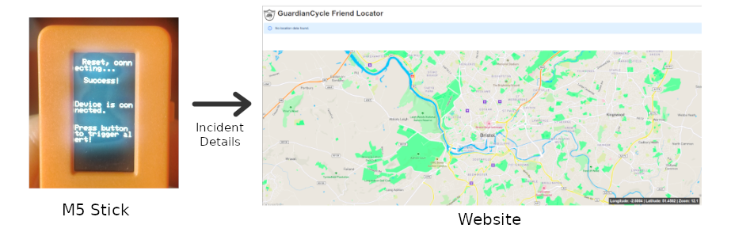

  <i>
  Figure ?. Overview of alert system.
  </i>

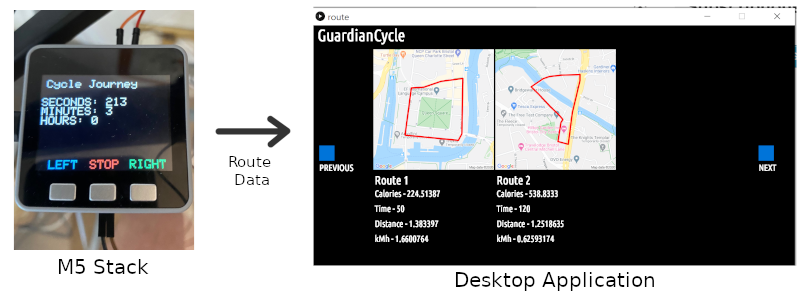

  <i>
  Figure ?. Overview of route tracker system.
  </i>

### Contents
- [a. Architecture of the Entire System](#a-architecture-of-the-entire-system)
- [b. Object-Oriented design of key sub-systems](#b-object-oriented-design-of-key-sub-systems)
- [c. Requirements of key sub-systems](#c-requirements-of-key-sub-systems-in-the-form-of-selected-user-stories)
- [d. The evolution of UI wireframes for key sub-systems](#d-the-evolution-of-ui-wireframes-for-key-sub-systems)
- [e. Details of the communication protocols in use](#e-details-of-the-communication-protocols-in-use-including-a-rational-for-your-choice)
- [f. Details of the data persistence mechanisms in use](#f-details-of-the-data-persistence-mechanisms-in-use-including-a-rational-for-your-choice)
- [g. Details of web technologies in use](#g-details-of-web-technologies-in-use)

### a. Architecture of the entire system
#### Overview
GuardianCycle’s system architecture is composed of three different sub-systems: the processing desktop application, the emergency services administrator portal/website, and the IoT devices (M5Stack and M5 Stick). Each of these sub-systems is designed to fulfil three specific use cases and facilitate the full setup and use of the entire GuardianCycle system.

Firstly, the processing-driven desktop application utilised a Google Maps Static API to track users route information and journey analytics delivered via JSON data file of GPS points from the M5Stack. Secondly, the emergency services website portal denoted user-wide activity and if any emergency signals were triggered by cyclists from their M5stack or M5Stick. Lastly, specifically the M5Stack tracked users route data, oriented an RGB LED indicator whilst both devices could send emergency GPS coordinates upon trigger in the form of a JSON string.

Communication between the systems is centred around JSON files through MQTT’s messaging protocol with each sub-system interacting with them in different ways. Information is sent regarding GPS points of a user’s route or location of a user upon fall or emergency. Furthermore, the desktop application would utilise JSON GPS coordinate data to perform journey analytics ie. distance travelled, calories burned, and specific user goals achieved and could send this data packet as a JSON file back to the MQTT server. Finally, the emergency services portal/website would use GPS coordinates from JSON files delivered by MQTT to denote any emergency activity from Guardian Cycle users.

  <i>
  Figure ?. Overview of system architecture 
  </i>

Three stakeholders - user (cyclists), friends or family (desktop application) and emergency services (website) - will interact with the GuardianCycle architecture at different stages. The IOT device is handled solely by the cyclist and primary user. The desktop application provides an interface for the user, family and friends to interact with the cyclists data collected from journeys - set personal bests, goals and provide aesthetic data interaction. Lastly, the web interface is for the emergency services to track activity from GuardianCycle users within a region and denote if any emergency signals have been triggered at any coordinates - enabling rapid response and ultimately saving GuardianCycle users' lives. 

### b. Object-Oriented design of key sub-systems

From the outset GuardianCycle endeavoured to take an object-oriented approach to the integration of key systems.  That is the various components that made up the system as a whole were considered as separate entities which each had its own set of encapsulated data and methods.  Considerable attention was given to how those encapsulated entities interfaced with each other, with a set of standard communication templates enforced throughout the project.

This was all the more important given what was the ambition of the project - GuardianCycle strove to provide a whole suite of functionality to the user, across a number of different platforms; which meant that the team as a whole needed to understand how myriad parts interlocked.  Taking this strong object-oriented approach fostered this understanding.

Indeed sketching out a UML use Case diagram for this system (under the early working title of CyberDome) showed the number of different stakeholders involved:

The complexity of interactions between these functions was further explored in a UML class diagram which extended standard UML by attempting to overlay stakeholders over encapsulated methods and data:

This initial work proved the necessity of deciding up front the interfaces between these  elements.  Therefore it was an early design decision to ensure that all data passing between entities would belong to one of two classes, _Route_ or _Update_:

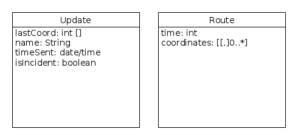

This ensured that all developers on the team understood exactly what data they could expect to send and receive from their individual components.  The components themselves however were also influenced by object oriented.

#### Desktop Application

The desktop application was written using Processing and a UML class diagram corresponding to the source code is below:

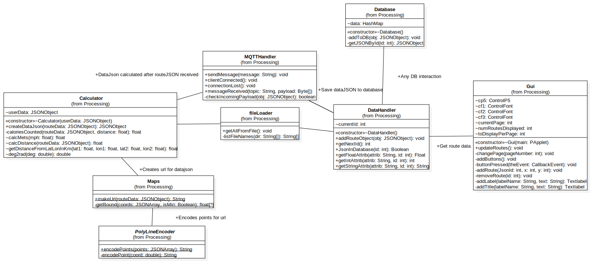

As illustrated the Processing code follows the object oriented design philosophy, with each class representing a modular functionality, using a form of Model-View-Controller design pattern.  In brief the _Gui_ class serves as the View - producing the various on screen elements (buttons, etc) and displaying data from the route to the user.  The Controller aspect is dually handled by _DataHandler_  and _MQTTHandler_ which is responsible for accepting input either from  the MQTT protocol or from the user and processing that accordingly.  Lastly the Model element is handled by _Calculator_, _Maps_ and _PolyLineEncoder_ which take the JSON data from the _Route_ class (referred to above) and runs it through algorithms to determine calories, distance covered, etc and correspondingly then place that data in geographical form (the _PolyLineEncoder_ acting to compress latitude / longitudinal data when sending over the lightweight MQTT network).

#### IoT Device

The M5Stack is a low-cost, lightweight, incredibly adaptable and internet-connected data collection device - consequently it was ideal for developing a GuardianCycle prototype. Despite these advantages the M5Stack did have some minor shortcomings. 

Notably, the lack of a GPS module located within the M5Stack meant that all users route data had to be hardcoded in the form of a JSON GPS coordinates string. Furthermore the poor and short battery life of the M5Stack resulted in the LED acting a significant battery drain. These design flaws are noted and mitigated in the future approach section.

The IOT device is envisaged as low-cost, low-energy, environmentally and user friendly - offering primarily useful LED and GPS functionaity. Collectively, we wanted the device to be durable, effective and safe for road use. Data was dually transmitted to either the emergency services website or the desktop application.  

  <i>
  Figure ?. Full state diagram of M5Stack
  </i>

The above state diagram captures all of the states available to the user whilst using the M5Stack for cycling. Indeed, the M5Stack has been designed to perform the essential role as primary handlebar controller of the LED whilst the user is cycling. Furthermore, at the end of journey or in the case of an accident - the M5Stack will provide route coordinates as JSON data packages to either the website or desktop application. 

After turning GuardianCycle on, a suitable startup sequence utilising Spiffs library to display an image sqeuence begins the M5 functionality. Before, the user is prompted to press the central button to start their respective cycling journey. 

  <i>
  Figure ?. Start-up sequence for M5Stack
  </i>

 

  <i>
  Figure ?. LED indicator prompting user to start journey
  </i>

After departure, the User will be presented with the M5Stack primary home screen. From this homescreen the user can use the Guardian cycles interface and buttons to:

* Render a route log drop down showing timer data. 
* Coordinate three different LED displays rendered by an LED matrix on the back of the helmet to provide optimal clarity to fellow road users.
* Terminate their journey and provide journey data to the desktop application. 
* Send an emergency signal to emergency services - containting precise GPS coordinates of their current location. 

We believed that this indicator functionality would be incredibly useful to other road users and prevent cyclists from having to rely upon arm gestures. Thus making on the road cycling easier, safer and preventing arm gestures from potentially causing cyclists to lose balance.  Here, the user has pushed button 1 to orient the LED and indicator to display left. The indicator will hold for 5 seconds – enabling ample time for the cyclist to perform the turn procedure safely:

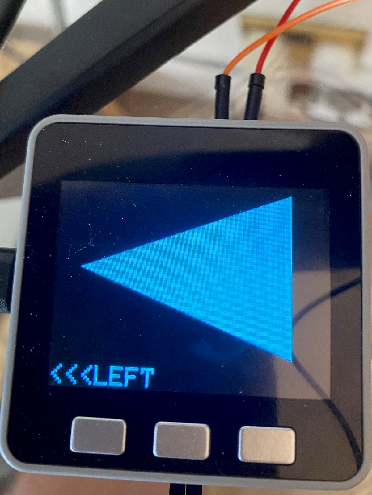

  <i>
  Figure ?. Button 1 press instantiating cyclist left turn 
  </i>

  <i>
  Figure ?. LED indicator rendered on left turn 
  </i>

If button 3 is pressed, the LED and UI will be orientated to perform the right-turn maneuver and indication. 

  <i>
  Figure ?. Display presented to cyclist on right turn 
  </i>

  <i>
  Figure ?. LED indicator rendered on right turn 
  </i>

Lastly, if button 1 is pressed and held for a duration of five seconds the LED and display will be orientated to perform an emergency sequence and a JSON GPS data package via MQTT will be sent to the website for the emergency services to view and locate the cyclists precise GPS position. Furthermore, the bright white light of the RGB LED would effectively notify fellow road users that the cyclist was in need of assistance. In much the same way, warning lights on cars are used to notify fellow road users that a car has broken down. In future development, we note that it would be ideal to have this light initated by a cyclists fall, consequently if the cyclist was unconscious or hurt this feature would be triggered automatically.

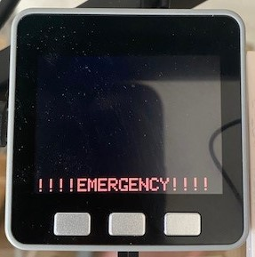

  <i>
  Figure ?. Display presented to cyclist in emergency scenario
  </i>

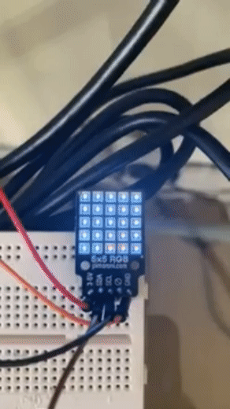

  <i>
  Figure ?. LED rendered in emergency situation
  </i>

The M5 stacks second button can then have be lightly pushed to provide route logging timer functionality before returning to the primary home page of the user interface. 

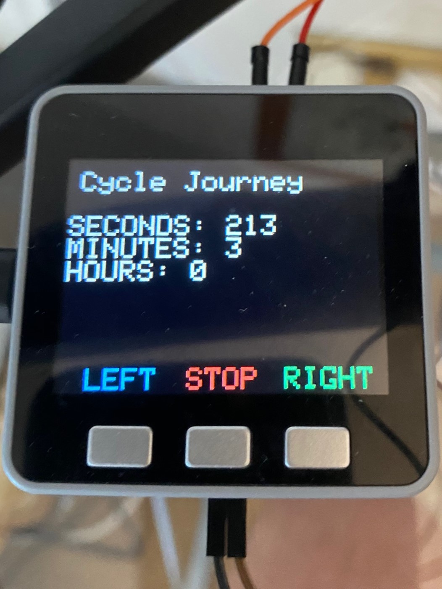

  <i>
  Figure ?. Display presented to cyclist giving themroute-logging timer functionality
  </i>

Functionality to send end of route journey data is triggered via pressing button 2 which will deliver an encoded polyline or JSON file containing route data via MQTT to be parsed and rendered by the desktop application for the user. Furthermore, in emergency scenarios the same procedure is followed but data will instead be sent to the website for the emergency services to provide assistance. This publishing of users coordinates and sending of JSON data packages from the M5Stack and stick via MQTT is displayed diagramatically as follows:

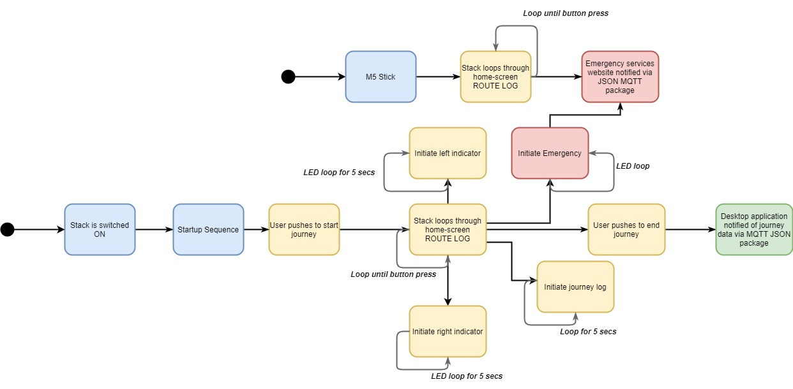

  <i>
  Figure ?. Loops, sequencing and MQTT publishing diagram of M5Stack and Stick
  </i>

The minimum viable product devised by GuardianCycle has two components acting as IoT devices, as discussed previously: the MD5 Stick and the MD5 Stack.  Object-oriented design was again key here - primarily in ensuring that they interfaced with the rest of the system in a way that ensured encapsulation of data.  

The MD5 Stack performed a number of different functions, namely starting route tracking, stopping route tracking, uploading route data and activating the left/right/hazard helmet display.  An example of the hazard indicator during early construction is displayed:

Both of these devices had far less complexity in their source code than the desktop application; so UML class diagrams have not been prepared.  However this UML activity diagram describes the flow of activity within the MD5 Stick:

As is illustrated the MD5 Stick can be used to alert the emergency services to an incident with two button presses - Arm and Alert; with positive confirmation needed to ensure the incident is raised, and an appropriate colour scheme (orange and red) to indicate escalation towards triggering the incident alert.  This is a secondary method for alarm activation - the primary one being the automatic fall detection present in the MD5 Stack gyroscope; however this has not been developed within the minimum viable product, instead the MD5 Stick is currently being used for demonstration purposes.

#### Web application

A UML class diagram of the friend-track-view web application shows object oriented design in work - although admittedly this was a more lightweight approach, being a relatively simple JavaScript React application, then the Java driven Processing desktop application: 

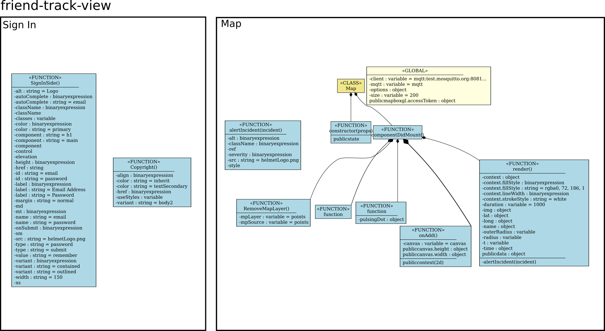

Components _login_ and _map_ pages are logically separate; while within the _map_ component we have a number of discrete elements dedicated to serving different functions e.g. _alertIncident_, _removeMapLayer_, etc.  

#### Importance of object oriented design

The importance of the object oriented paradigm however is potentially easiest to understand when we look at the activities of all three key sub-systems working together in harmony, as illustrated in this UML activity state diagram, which visualises a number of functions of the finished product (with gyroscope enabled - currently on the development plan):

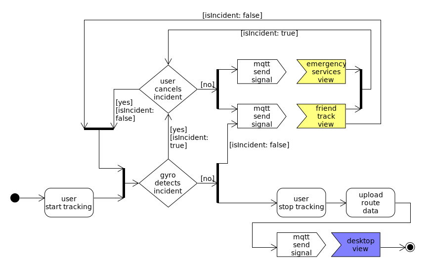

Within the diagram white represents the IoT device, yellow the web application and blue the desktop application.  Once the user starts tracking, the gyroscope immediately enters a loop whereby it looks for incidents.  If one is found then the user has an opportunity, using the MD5 Stick, to report a false-positive and reset the alarm; if the user does not cancel however then via MQTT an _update_ object is sent to both web applications (_emergency-services-view_ and _friend-track-view_ informing them of the incident) - this continues to loop as long as there is power in the device and the incident has not been cancelled.  If the gyroscope does not detect an incident then a location update is sent to _friend-track-view_ only on a periodic basis.  This continues until the user stops tracking at which point they have an option to upload their route data, again via MQTT, to the desktop application where it can be viewed in Processing.  

A rigorous separation of data between these elements by using defined interfaces, e.g. object oriented design, is therefore necessary to manage this system effectively and safely considering the importance that users will place in it.

### c. Requirements of key sub-systems (in the form of selected user stories)

The user stories detail the many different interactions the three different stakeholders - users, friends or family and emergency services - will inevitably have whilst utilising the GuardianCycle architecture. Designing user stories was an invaluable tool for understanding how stakeholders would effectively utilise the system and to demonstrate how the system should be properly used. Furthermore, user stories helped orient the device to effectively determine which profile of users and target audience the device was best suited too. 

##### User Story 1

Dave is a keen cyclist who commutes to work everyday, and rides long distances at the weekend. He would like to keep track of his improving times and distances and share how he is progressing with friends and family. He is passionate about fitness and potentially wants to compete in an Iron Man competition next year. 

##### User Story 2

Hannah is trying to lead a more healthy lifestyle and is starting to cycle occasionally. She would like to know how many calories she is burning by riding her bike and track her improvement. She hopes to lose weight and improve her lifestyle. 

##### User Story 3

Kevin is a mountian biker who is often alone for long periods of time in the hills. He is increasingly worried about his personal safety whilst mountain biking especially when the weather is poor and would like a way to get quick and direct help if there was an accident. 

##### User Story 4 

Mary is a mother of three, whose eldest son rides their bike to school everyday. She would like to know her child is getting to school as safely each day - there family home is located in a busy commuter belt. Furthermore she would like to be able to track her child's location to make sure they get to school and back home.

##### User Story 5

John is a cycling enthusiast and experienced first responder - he has worked for the emergency services for a number of years. In his local rural area has struggled to find an effective means to track down cyclists injured in the mountains and on the road. Particularly due to the lack of local landmarks and road signs.

#### Requirements of key subsystems

In light of these user stories - utilising disciplined agile practices we tried to prioritise the concerns and desires raised from the user stories. As well as develop a clear profile of potential Users of the GuardianCycle. 

#### Profile of users from stories

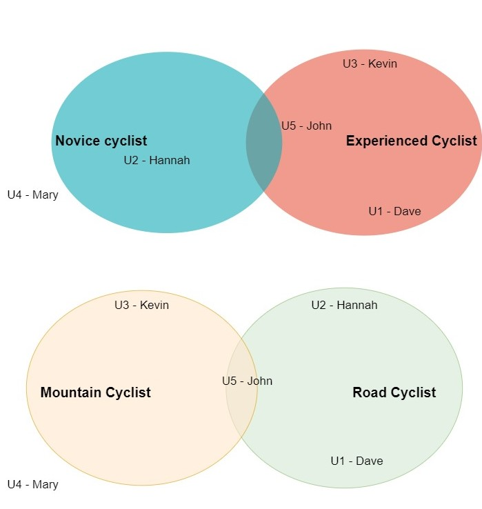

  <i>
  Figure ?. User story pool venn diagram
  </i>

These diagrams demostrate that from the User Story section, a wide pool of users would be potentially interested in purchasing the GuardianCycle. Indeed, users from disparate backgrounds such as non-cyclists demonstrated interest in the GuardianCycle. Furthermore, different fields of cyclists would be intersted - including Mountain and Road cyclists. Also cyclists with different levels of experience from novice to experienced. 

#### Hierarchy of priorities 

  <i>
  Figure ?. Six priorities for agile design process emphasised from user stories
  </i>

In response to these requirements we calibrated certain key requirements for developing subsystems. 

#### IoT device

* The M5Stack had to be communicative and send necessary data to the desktop application and website application - enabling tracing functionality for Guardian cycle with JSON route data sent via Hive MQTT. 
* The Stack had to fully render an RGB LED matrix to display the cyclists state (manoeuvres and emergency) to fellow road users - enabling complete safety.
* The UI of the Stack had to be clean and clear preventing the cyclist from losing focus whilst cycling and dealing with needless distractions. 
* The M5Stack UI had to be intuitive for all age ranges - enabling any cyclist of any level of experience to effectively use the GuardianCycle - satisfying the wide user pool of potential users. 
* The route log functionality was developed to enable users to gain some cycling data and try and beat their own personal best times. This would satisfy user priorities for improvement. 
* The M5 Stack had to detect incidents (using its internal gyroscope) and initiate an emergency event - functionality not included in the minimum viable product.
* The M5 Stick had to allow users to manually initiate an emergency event, or cancel an emergency event in the event of automatic detection.

#### Desktop application 

* Allow users to see information about the rides they have completed. Information must include information about speed, distance and the count of calories burned to fulfil [User Story 1](#user-story-1) and [User Story 2](#user-story-2). 
* Clearly show this information to the user in a clean and intuitive UI. Maps of previous routes were used to create a visually pleasing UI and provide more information about previous routes.
* Save all incoming route information so that users can restart the programme and still see all completed rides.
* Calculate all necessary route information from a set of coordinates sent from the m5Stack.

#### Web application 

* Provide an up to date and clear indication of a cyclist's location to selected friends and family (such as the mother Mary in [User Story 4](#user-story-4)).  

* Differentiate to friends and family between normal activity and whether an incident had occurred (either detected automatically by gyroscope or manually initiated).  

* Alert friends and family by SMS or email in the event of an accident - functionality not included in the minimum viable product.  

* Ensure sensitive location data was only shared with authorised parties by the use of secure authentication.

* Provide up to date and clear indication of a cyclist's location to the emergency services in the event of an incident (as per John in [User Story 5](#user-story-5)) - noting that in the final product it is envisaged incident data being sent by the IoT device directly into systems owned and operated by emergency services control rooms.

### d. The evolution of UI wireframes for key sub-systems

#### Paper Prototype – User Testing

  

  A sample section of the paper prototype video.

An early part of the process saw the development of a paper-prototype that was tested with several people. By using the paper prototype as a simulation for test users, this allowed us to quickly and efficiently test the key features of our design. 

Whilst the initial tester feedback was positive, in as much as the system was simple to use and understand, concerns were raised by one user who objected to having to provide email or other data that would enable them to be identified.

As a response, we agreed the finished product wo  This would enable the fundamental road safety element – that of indicator/break lights to still be used.  Unfortunately the GPS system required the website registration to be active, so the fall alert would not function in this user case.

Our user interface developed considerably from the initial paper prototype but retained some of the key features. The key features we retained include the journey analytics and the route viewer (albeit in a very different format).

The most notable difference is that the paper prototype was designed with a mobile application in mind (as evidenced by the phone screen background). However we later learned that the specification involved a web application, a desktop application and an interface on the M5 devices, which all required a significant re-think in terms of design. 

#### Desktop Application

The key purpose of the desktop application is to display the previous routes the user has taken. The secondary purpose is to display back to the user.

For the initial stages, the user interface was not a primary concern. Our main focus was ensuring the required functionality was attainable so initial wireframes simply involved one static map.

Once this was established, we merged this interface with the analytics function which would display the statistics for the displayed route.

We then decided we could be utilising the screen space more efficiently. Most notably, that we could fit multiple routes onto the page without it being overcrowded. At this stage, we experimented with a mulitude of different views to determine a best fit. This involved striking the right balance between displaying as much information as possible and the screen being too overcrowded. 

  

  Image: One of the early interface designs.

At the same time, we also wanted our design to be clear and intuitive so we kept the main features aligned and centralised. The font was also updated from the default font to a more modern font we felt was more in-line with our brand image.

  

  Image: Screenshot of final user interface.

Lastly, we realised we wanted to display more routes to the user and that the most practical way to do this was through the use of buttons to allow the user to scroll through a list of routes. By implementing this, the user could view an effectively unlimited number of routes by scrolling at their leisure.

#### Web Application
In order to create the paper prototype, time was spent comparing a variety of online mapping products - Google Maps, OpenStreetMaps, OS Maps and the What's App Share Location specifically.  Once a representative sample was obtained a prototype was mocked-up of what information the emergency services or a shared contact would wish to see.  A key requirement for this it was felt was a clean interface - neither user would wish to be presented with unnecessary or distracting information; the resulting prototype is shown below:

  

The final version of our website maintained the key features of the paper prototype above. The user interface is minimalist with the key feature, the map, featuring prominently taking up the majority of the space on the page. This is in order to make the incident location as clear as possible for the user.

#### Hardware development 

Initially sufficient testing was performed on the capabilities of LED matrix utilising an arduino. After which, the M5Stack was been designed to perform the essential role as primary handlebar controller of the LED. The LED in this case a 5X5 RGB Matrix from Pimoroni is connected to the M5Stack via the GPIO pins. This is also displayed in clear diagramatic form as follows with connection on GPIO pins GND (Ground), SCL (Serial Clock), SDA (Serial Data) and 5V. 

  <i>
  Figure ?. Picture of M5Stack-LED setup whilst in development
  </i>

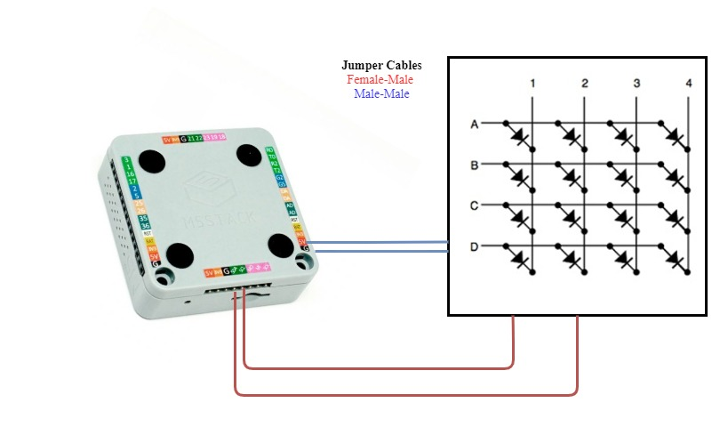

  <i>
  Figure ?. Diagram figure of M5 setup with 5x5 matrix
  </i>

#### M5Stack UI development 

The initial user interface designs for the M5Stack were basic, simply encoding button press functionality to change colours of orbs on the screen display. In order to gain familiarity with the M5Stack hardware.

  <i>
  Figure ?. LED coloured orbs gaining familiarity with M5Stack hardware
  </i>

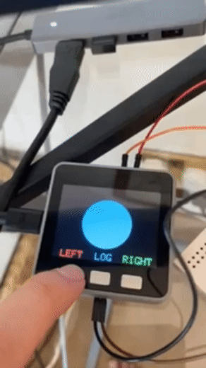

  <i>
  Figure ?. Initial prototyping of M5Stack UI 
  </i>

After this was acheived, clear colours were chosen for each command to enable clear visual clarity to the cyclist whilst in motion. Large arrows were programmed on the display and clear capital letters added to explain each maneuver: 

* Large blue arrow for left indicator signals.
* Large green arrow for right indicator signals.
* Red to denote emergency status has been triggered.

Having effectively programmed maneuvers, development moved towards a press and hold feature to enable the triggering of an emergency situation for the cyclist. Collectively, it was decided that push and hold for 5 seconds to signal the declaring of an emergency was most effective to mitigate against mistaken pushes and triggering of an emergency. Particularly as the M5Stack's gyroscope had been difficult to function properly with the RGB 5x5 LED. 

Following this, we decided to present the user with a button press to initiate the start of the cycle for the sake of clarity. Followed by basic route log display on push of button 2 to provide the cyclist with journey progress data and the timings concerning progress made during their current cycle. As a later UI design change, for aesthetic purposes it was decided to create a slightly more desirable startup sequence when the M5Stack was turned on - this helped make the device a more coherent and developed product. Particularly, typography was slightly modified from small and indiscernable writing to a clear coloured and eye-catching sequence.

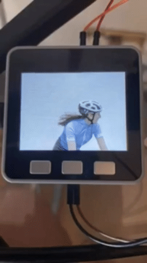

  <i>
  Figure ?. Original intro sequence to M5Stack UI with indiscernable font
  </i>

Throughout the design process we tried to keep the Stack's UI clean, functional and simple. We considered this desirable so as to prevent any forms of distraction for the cyclist - thus maintaining their eyes on the road at all times. This design feature has been adopted by numerous other applications - for instance, mobile phones automatically activating Do Not Disturb during car journeys.

#### M5Stick UI development 

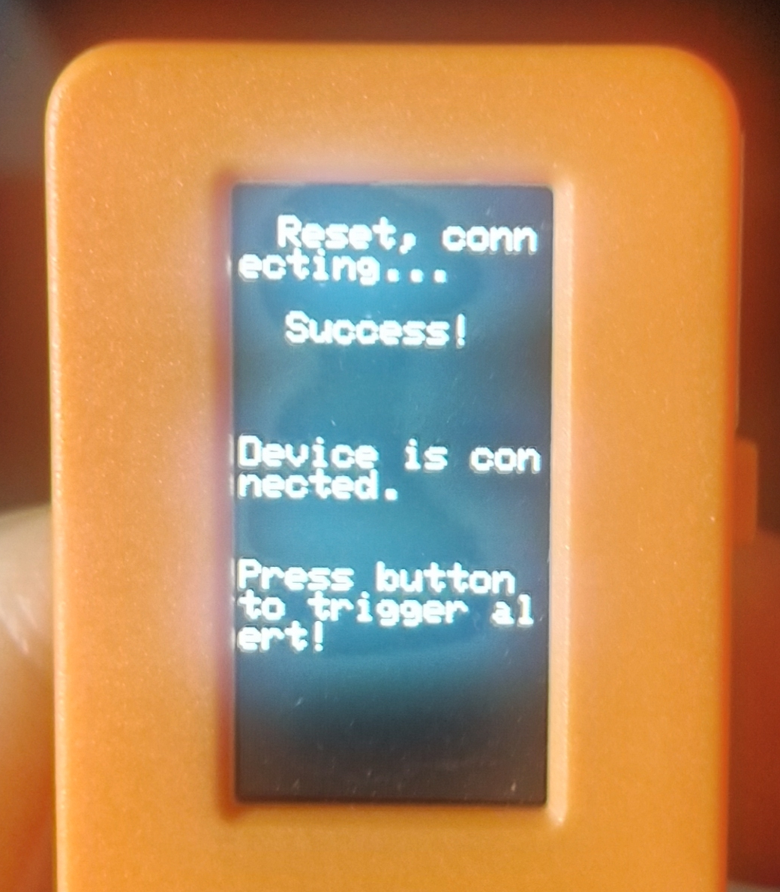

  <i>
  Figure ?. M5 Stick Intro UI 
  </i>

The small size of the screen and the limited input methods on the M5 stick was very limiting and I realised any complicated user interface loaded onto the stick would likely not be properly visible to the user.

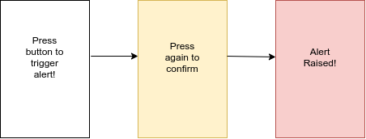

  <i>
  Figure ?. Wireframes for M5 Stick UI
  </i>

With this in mind, I created a minimalist user interface that consisted simply of colours to indicate the state of the device and a short section of text indicating which state the device was currently at.

### e. Details of the communication protocols in use (including a rational for your choice)
The devices communicated with the website and desktop application by sending small JSON files (in text format) via MQTT and Mosquitto (for web communication).

I have included a simple diagram below to illustrate how the data is communicated between the devices to the website and desktop application:

#### JSONs
We decided on using the JSON format as firstly, it could be sent in a simple text format and secondly, could contain key details our program required such as geo co-ordinates. The details of the JSON structures we utilised are explained in more detail [on our data communication page.](https://github.com/HumphreyCurtis/GuardianCycle/tree/master/data-communication)

Example of an update JSON for an incident.

**"lastCoord"**  The geo-coordinates of the incident.   
**"name"** Name of the user.   
**"timeSent"** Date and time of the incident.   
**"isIncident"** The incident status (boolean). True is an active incident.   

#### Rational for using Mosquitto over MQTT
While implementing our website, we had difficulty integrating the functionality with MQTT. Specifically, there were issues whereby the browser would flag the site as being insecure and which could only be remedied by modifying the browser settings to allow insecure content. We realised this was not a reasonable expectation for most users so we decided to change the network protocol across to Mosquitto. 

### f. Details of the data persistence mechanisms in use (including a rational for your choice)
The only data persistence mechanism used in this system is flat file saving in the desktop application. This saves any incoming JSON files to the application computer as .JSON files, with a random string of numbers as the file name. When the application is loaded, the program looks through the data folder and reads every JSON file, creating a route object for each file. In a final application an online database would be used instead of flat files, so the information could be loaded by multiple devices. For this project it was enough to just save flat files as it mimicked the functionality of an online database well. A local database could have been created instead of saving flat files, but the files are fairly simple, only containing two columns for coordinates and time. Therefore it made sense to save it simply as a JSON file and not try and split the information up into tables. 

For the website and M5Stack parts of the system no data persistence was implemented. In a final version of the system it would make sense for both of these sections to have data persistence. Perhaps the website could save every incoming JSON in a similar way to the desktop application, for keeping records about any accidents that occur. In the m5Stack it might be a good design choice to automatically save the coordinate information while the device is recording a ride. If the device ran out of battery while it was tracking the ride, all information would be lost. This is not a huge drawback for the M5Stack part of the system however. In a final version the stack would include a sim card so it would be uploading the information to a server constantly, and would therefore not need to save the coordinate information on board.

### g. Details of web technologies in use

The web application was entirely built using the React web framework, for a number of reasons.  Not least of these was because React is an extremely popular framework, topping StackOverflow's 2019 list for both most [Loved and Wanted Web Framework](https://insights.stackoverflow.com/survey/2019#technology-_-most-loved-dreaded-and-wanted-web-frameworks).  Although popularity is not a positive in itself, the byproducts of having a vibrant ecosystem is - there are plentiful online resources and documentation, and when time comes to scale GuardianCycle it will not be difficult to find a pool of talent who can easily adapt to the technologies in use by the team.

Aside from its popularity, React also proved a good fit in other ways.  As React uses a virtual Document Object Model (DOM) and a [reconciliation algorithm](https://reactjs.org/docs/reconciliation.html) it can update changes on page quickly without having to refresh the entire DOM.  This speed is a key feature for a visualisation tool which is updating repeatedly to show a revised position.  Also React being based around components allows re-use of code and makes it easy to impose a standard style, this fitted in very well with the object oriented design aspects of development; although admittedly this is likely something that would be used at scale - there was less need for this within a minimum viable product.  Even so however within the current prototype use was made of [material-ui](https://material-ui.com) a library of web components which allows easy implementation of a standardised and professional user interface.

For the mapping solution within the web application [mapbox](https://www.mapbox.com) was selected.  As well as being able to provide a mapping solution that was ideal for the site (clutter-free and easily understandable), they also featured excellent tutorials, compatibility with GeoJSON (one of the standards we are using) and have a free pricing tier which was an important consideration prior to funding.

For connecting the website to the MQTT protocol, the [MQTT.js](https://github.com/mqttjs/MQTT.js) client library was used which is written in JavaScript and is intended for both node.js and the browser.  Consideration was also given the to [Eclipse Paho](https://github.com/eclipse/paho.mqtt.javascript) JavaScript client - indeed the client was actually used successfully to receive messages when investigations were underway to determine the reason for a WebSocket Secure failure - which ultimately turned out not to be dependent on the client library.  Eventually however MQTT.js was chosen due to its more extensive documentation and because its github repository was more actively maintained than its competitor.

Hosting was achieved using [Vercel](https://vercel.com) (formerly Zeit) which allows command line deployment of React/node.js web applications in a frictionless manner, and also features a free tier pricing model.  Vercel also provides robust solutions and good documentation to ensure private API keys (which were required for mapbox) are not publicly viewable once deployed, which was required for the pilot.

